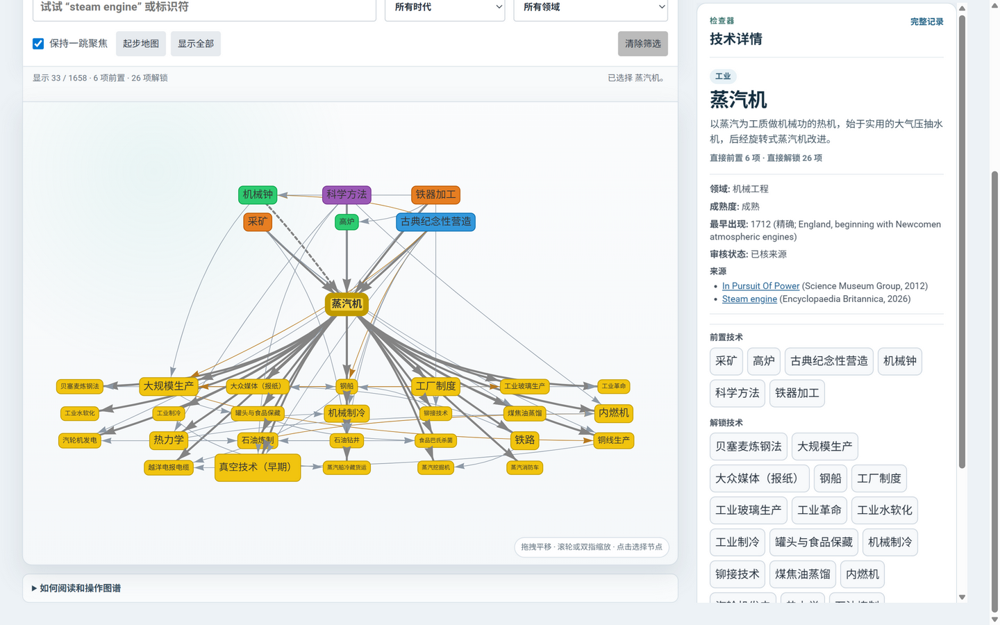
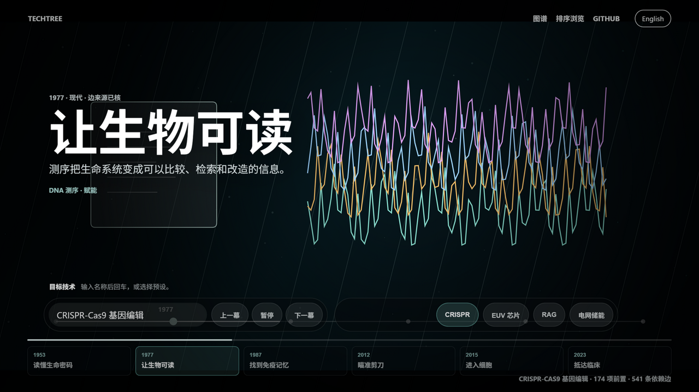
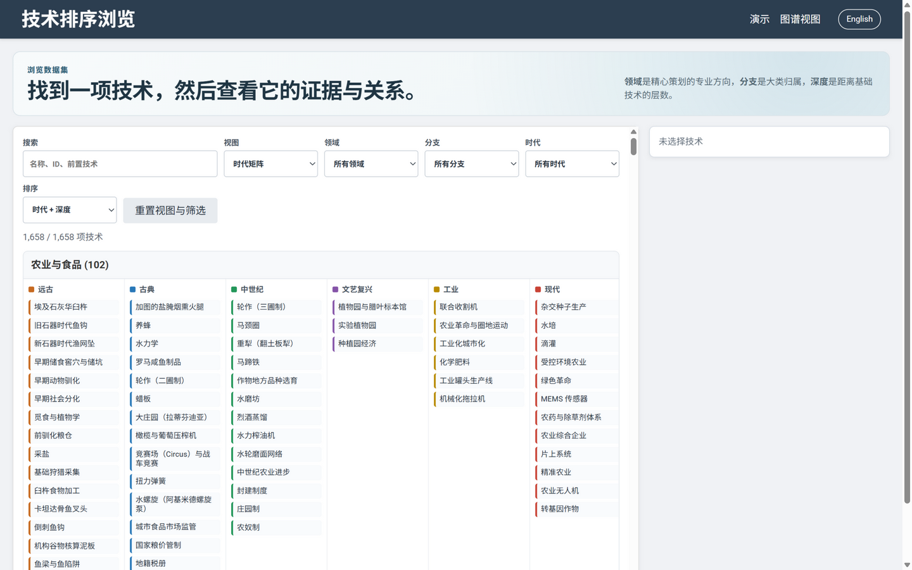

# TechTree

[](LICENSE)
[](data/)
[](https://github.com/myt2000/treeTech/actions/workflows/data-quality.yml)

**TechTree 是一张有来源支撑的人类技术地图：每项技术依赖什么、解锁什么、未来可能走向哪里，一目了然。**

整站提供**中英双语界面**，页头一键切换（默认跟随浏览器语言，选择会被记住）。数据层面，全部 1,658 条技术均配有经审校的中文与英文名称、描述，技术编号与文献引用保持英文原貌。

## 界面一览

### 图谱视图 —— 竖向依赖网络

时间自上而下流动：远古在上，现代与未来在下。前置技术汇入上方，解锁技术向下方展开；选中任意节点即可在右侧查看领域、成熟度、审核状态与文献来源。



### 纪录片演示 —— 目标技术的来路

以纪录片式的动态时间线，逐幕回放一颗目标技术（如 CRISPR、EUV 芯片、RAG、电网储能）背后的完整前置技术栈。



### 排序浏览 —— 时代矩阵与紧凑列表

按时代、领域、分支、依赖深度、成熟度和路线图状态快速扫描全部技术。



## 快速开始

TechTree 只需要 [Node.js 20+](https://nodejs.org/)，没有任何运行时依赖。

```bash
git clone https://github.com/myt2000/treeTech.git
cd treeTech
npm start
```

然后打开：

- 图谱视图：`http://127.0.0.1:3000/`
- 纪录片演示：`http://127.0.0.1:3000/demo.html`
- 排序浏览：`http://127.0.0.1:3000/sorted.html`

本地服务器默认只绑定本机回环地址，并以只读模式运行。

## 三种浏览方式

| 视图 | 适合做什么 |
| --- | --- |
| [图谱视图](index.html) | 探索完整的依赖网络：搜索、时代/领域筛选，以及单条依赖边的证据详情。 |
| [纪录片演示](demo.html) | 回放某个目标技术身后的前置技术栈，并展望它可能催生的后续发展。 |
| [排序浏览](sorted.html) | 按时代、领域、分支、依赖深度、成熟度与路线图状态紧凑浏览全部技术。 |

## 核心特性

- 收录从远古到未来的 **1,658 validated technologies**（1,658 项经过来源核验的技术）。
- 检查带类型的依赖边：置信度、证据等级、说明文字与来源一应俱全。
- 沿策划好的领域视角穿行：计算、生物、能源、基础设施、金融、航天、制造……
- 每项技术和领域都有稳定的静态页面（`tech/<id>.html`、`fields/<slug>.html`）。
- 中英双语：界面一键切换；技术名称与描述的中文译文由 `data/i18n/zh.json` 提供，译法遵循[中文术语表](docs/ZH_GLOSSARY.md)。
- 在研究、教学和软件项目中直接使用经过校验的 JSON 数据集，或只读接口 `GET /api/tech-tree`。
- 自动化检查捕捉缺失前置、循环依赖、年代倒置、薄弱证据与过期的语义改动。

<details>
<summary><strong>当前数据质量快照（自动生成，英文原文）</strong></summary>

<!-- QUALITY_SNAPSHOT_START -->
## Quality Snapshot

Generated 2026-09-28 from the same dataset audit used by `npm run accuracy:risks`. This is a launch-quality trust snapshot for non-Future nodes, not proof of global accuracy.

Future-era technologies are forecast/roadmap nodes. They are structurally validated, but they are excluded from launch-quality source-check, placeholder-date, edge-source, source-fit, and source-URL gates.

| Metric | Current |
| --- | --- |
| Technologies | 1,658 |
| Launch-quality scope (non-Future nodes) | 1,420 / 1,658 (85.6%; 238 Future excluded) |
| Source-checked nodes | 1,420 / 1,420 (100.0%) |
| Source-checked nodes with resolved chronology | 1,420 / 1,420 (100.0%) |
| Source-checked nodes with unresolved chronology | 0 / 1,420 (0.0%) |
| Source-checked nodes with strong-type node sources | 1,304 / 1,420 (91.8%) |
| Source-checked nodes with located strong-type evidence | 782 / 1,420 (55.1%) |
| Source-checked nodes using only weak/generic sources | 0 / 1,420 (0.0%) |
| Nodes with node-level sources | 1,420 / 1,420 (100.0%) |
| Nodes with located node-level evidence | 850 / 1,420 (59.9%) |
| Dependency edges with edge-level sources | 3,941 / 4,072 (96.8%) |
| Dependency edges with located evidence | 1,083 / 4,072 (26.6%) |
| Era-default placeholder dates | 0 / 1,420 (0.0%) |

Manual remediation audits are tracked separately from headline accuracy metrics; see docs/QUALITY_SNAPSHOT.md.

Full generated snapshot: [docs/QUALITY_SNAPSHOT.md](docs/QUALITY_SNAPSHOT.md).
<!-- QUALITY_SNAPSHOT_END -->

</details>

## 数据与贡献

正典数据存放在 [`data/`](data/) 目录下按时代拆分的 JSON 文件中。我们更欢迎小而准、带来源的修正，而不是大而空、无来源的添加。

- 从 [贡献指南](CONTRIBUTING.md) 开始，了解编辑方式、校验流程与受信任的本地写入模式。
- 修正依赖关系请参考[单边 PR 指南](docs/ONE_EDGE_PR_GUIDE.md)或[依赖边审查手册](docs/EDGE_REVIEW_PLAYBOOK.md)。
- 补充数据缺口前请先阅读[数据覆盖说明](docs/DATA_COVERAGE.md)。
- 较大规模的数据扩充请遵循[技术扩充手册](docs/TECH_EXPANSION_RUNBOOK.md)（基于 TSV 批量导入）。
- 只想补一条来源定位？参见[来源定位贡献指南](docs/SOURCE_LOCATOR_CONTRIBUTIONS.md)。
- 自动化维护者请使用精简的 [Agent 交接文档](docs/AGENT_HANDOFF.md)。

### 中文翻译的维护

- 中文界面文案与枚举标签集中在 `i18n-zh.js`（同时也是静态页生成器的文案来源）。
- 技术名称与描述的译文存放在 `data/i18n/zh.json`，通过 TSV 批次（`data/i18n/zh-batches/`）合并，**不要**手编正典时代 JSON。
- 修改后运行 `npm run i18n:check:strict` 确保译文覆盖 100% 的技术条目。

## 常用命令

| 命令 | 用途 |
| --- | --- |
| `npm start` | 启动本地只读服务器。 |
| `npm test` | 运行语法、服务器、数据结构与年代一致性检查。 |
| `npm run quality` | 运行证据、回执、不变量、指标与站点质量门禁。 |
| `npm run coverage` | 按时代和技术分支输出覆盖率报告。 |
| `npm run build:public` | 生成稳定的技术与领域静态页。 |
| `npm run check:public` | 校验生成的公开页面是否完整且最新。 |
| `npm run i18n:import` | 把 `data/i18n/zh-batches/` 中的 TSV 批次合并进 `data/i18n/zh.json`。 |
| `npm run i18n:check` | 校验中文译文与正典数据的一致性（`--strict` 要求 100% 覆盖）。 |

## 许可证

TechTree 基于 [MIT License](LICENSE) 开源。
